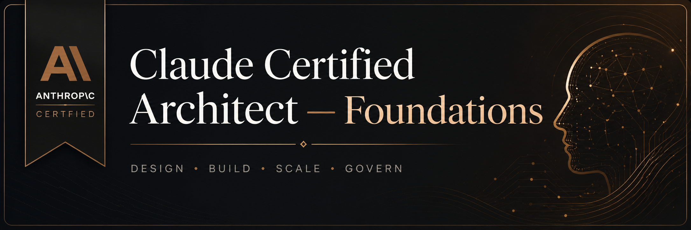
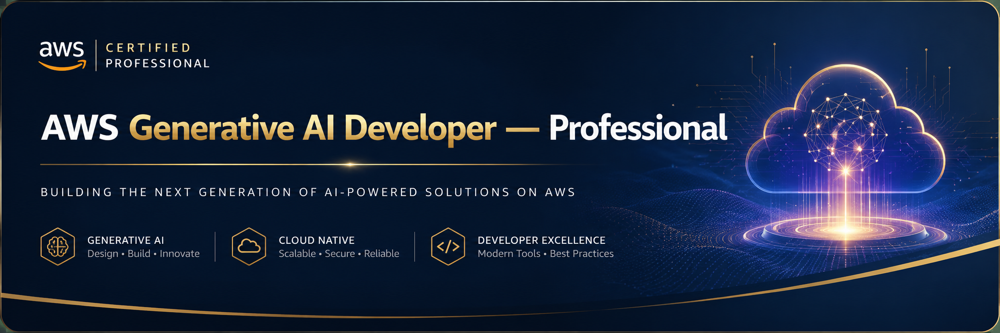
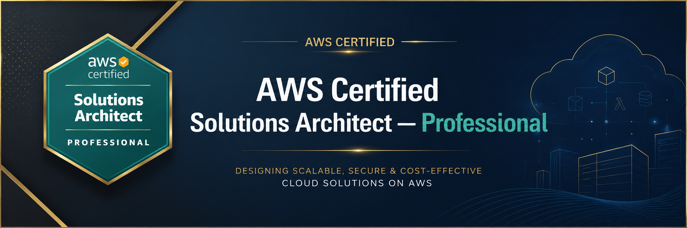
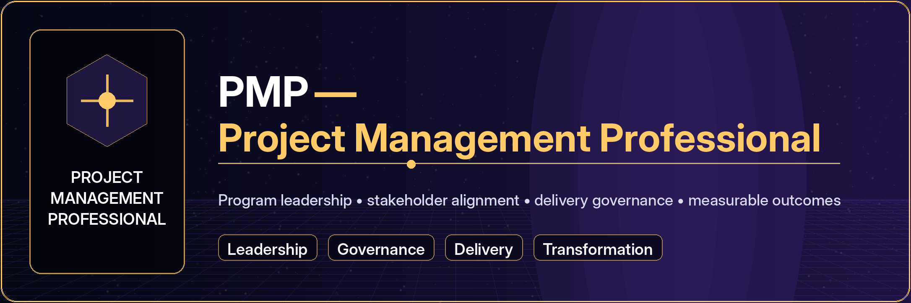
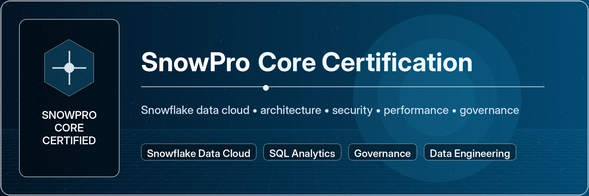
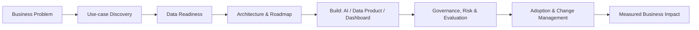

<!--
✨ Executive GitHub Profile README for Shubham Chandra
Repo name should be exactly: Shubham235Chandra/Shubham235Chandra
Positioning: Senior Manager | AI & Data | GenAI | Cloud | Enterprise Transformation
-->

<div align="center">
  
</div>

<h1 align="center">Hi, I'm Shubham Chandra 👋</h1>

<h2 align="center">Senior Manager — AI, Data & Cloud Platforms</h2>

<h3 align="center">
  AI Strategy • Enterprise Data Architecture • GenAI Platforms • Cloud Modernization • Team Leadership
</h3>

<p align="center">
  <b>I lead at the intersection of AI, data, cloud, engineering, and business impact.</b><br/>
  Turning complex enterprise problems into scalable data products, AI-powered workflows, executive dashboards, and measurable outcomes.
</p>

<p align="center">
  <a href="https://shubham235chandra.github.io/" target="_blank">
    
  </a>
  <a href="https://www.linkedin.com/in/shubhamchandraai/" target="_blank">
    
  </a>
  <a href="mailto:shubhachandrawork@gmail.com">
    
  </a>
  <a href="https://twitter.com/imbidexter" target="_blank">
    
  </a>
</p>

<p align="center">
  
  
  
  
  
</p>

---

## 🧠 Executive Snapshot

I am a **Senior Manager and AI/Data leader with nearly 12 years of experience** across **enterprise data platforms, financial services analytics, GenAI adoption, cloud modernization, and consulting-led delivery**.

My strength is the blend of **managerial ownership + technical depth**: I can work with leadership on strategy, partner with stakeholders on outcomes, and go deep with engineering teams on architecture, data pipelines, AI systems, governance, and delivery execution.

- 🧭 **Leadership:** AI & data strategy, delivery ownership, stakeholder management, roadmap planning, team enablement
- 🤖 **GenAI:** Claude, OpenAI/Codex, LLM apps, RAG, agentic workflows, prompt engineering, AI-assisted SDLC
- ☁️ **Cloud:** AWS, Azure, GCP, cloud data platforms, modernization, scalable architecture, automation
- 📊 **Data:** Data engineering, analytics, BI, dashboards, data quality, governance, SQL/Python, ML workflows
- 🏦 **Domain:** Financial services, risk-aware analytics, enterprise reporting, business transformation
- 🎓 **Certifications:** Strong certification portfolio across **AI, data, cloud, analytics, and enterprise technology**

> **My operating principle:** AI should not be a demo. It should become a trusted, governed, measurable capability inside the business.

---

## 💼 Work Experience Positioning

<table>
<tr>
<td width="34%">

### 🏢 Senior Managerial Leadership
**AI, Data & Cloud Transformation**

- Enterprise delivery ownership
- Cross-functional stakeholder leadership
- Strategy-to-execution planning
- Team mentoring and capability building
- Business value realization

</td>
<td width="33%">

### ⚙️ Enterprise Data & Engineering
**EPAM / Consulting-led Delivery**

- Data platform modernization
- GenAI and analytics enablement
- Cloud-native solution thinking
- Engineering delivery governance
- Client-facing technology leadership

</td>
<td width="33%">

### 🏦 Financial Services Foundation
**Morgan Stanley / BFSI Analytics**

- Finance and risk-aware analytics
- Reporting and decision intelligence
- Data-driven automation
- Controls-first execution mindset
- Enterprise-grade delivery standards

</td>
</tr>
</table>

> Many enterprise/client projects cannot be fully public on GitHub, so this profile highlights my **leadership direction**, **technical toolkit**, and **selected personal/open projects**.

---

## 🚀 What I Bring to the Table

<table>
<tr>
<td width="50%">

### 🤖 AI & GenAI Transformation
- Enterprise GenAI use-case discovery
- Claude, Codex, ChatGPT and AI-assisted engineering
- RAG, agents, knowledge assistants and workflow automation
- LLM evaluation, guardrails and responsible AI mindset
- GenAI adoption roadmaps for business teams

</td>
<td width="50%">

### 📊 Data Strategy & Platforms
- Data products and analytics modernization
- Data engineering pipelines and architecture
- KPI frameworks, semantic metrics and dashboards
- Data quality, governance and observability thinking
- SQL/Python-first decision systems

</td>
</tr>
<tr>
<td width="50%">

### ☁️ Cloud & Modern Engineering
- AWS, Azure and multi-cloud solutioning
- Cloud data platforms and scalable analytics
- CI/CD, automation and DevOps collaboration
- MLOps/LLMOps readiness and production thinking
- Cost, security and reliability awareness

</td>
<td width="50%">

### 🧑‍💼 Senior Management & Delivery
- Program ownership and execution governance
- Stakeholder communication and executive storytelling
- Agile delivery, prioritization and roadmap planning
- Team enablement, mentoring and hiring support
- Outcome-focused transformation leadership

</td>
</tr>
</table>

---

## 🧭 2026 Focus Areas

```yaml
leadership_identity:
  - Senior Manager: AI, Data, Cloud and Business Transformation
  - Strategy + Architecture + Delivery + Governance
  - Enterprise AI adoption with measurable business outcomes

ai_now:
  - Claude for analysis, reasoning, research and business workflows
  - OpenAI Codex for AI-assisted software delivery and automation
  - RAG systems over enterprise knowledge and documents
  - Agentic AI for operations, analytics, support and engineering productivity
  - LLM evaluation, safety, governance and observability

data_now:
  - Data products and data platform modernization
  - Cloud-native data engineering on AWS, Azure and GCP
  - Executive analytics, BI modernization and KPI frameworks
  - ML/AI pipelines that are reliable, explainable and scalable

managerial_edge:
  - Translating strategy into delivery roadmaps
  - Aligning engineering, product, risk and business stakeholders
  - Building teams that can ship, scale and sustain AI/data capabilities
```

---

## 🛠️ Executive Tech Stack

### 🤖 AI, GenAI & AI-Assisted Delivery
<p>
  
  
  
  
  
  
  
  
  
  
  
  
  
  
</p>

### ☁️ Cloud, Data Platforms & Engineering
<p>
  
  
  
  
  
  
  
  
  
  
  
</p>

### 📊 Data Science, Analytics & BI
<p>
  
  
  
  
  
  
  
  
</p>

### 🧑‍💼 Leadership, Delivery & Transformation
<p>
  
  
  
  
  
  
  
  
</p>

---

## 🎓 Certifications & Continuous Learning

I maintain a **certification-heavy learning profile** across the areas that matter most for modern AI/data leadership.

<p align="center">
  
  
  
  
  
</p>

<p align="center">
  
</p>

<p align="center">
  
</p>

<p align="center">
  
</p>

<p align="center">
  
</p>

<p align="center">
  
</p>

<table>
<tr>
<td width="25%">

### 🤖 AI & GenAI
- Claude / Anthropic ecosystem
- Generative AI architecture
- Prompt engineering
- Responsible AI
- AI-assisted delivery

</td>
<td width="25%">

### ☁️ Cloud
- AWS Solutions Architect — Professional
- AWS Generative AI Developer — Professional
- Microsoft Azure and Google Cloud
- Cloud modernization
- Cloud data services

</td>
<td width="25%">

### 📊 Data & Analytics
- SnowPro Core Certification
- Data engineering
- BI and visualization
- SQL/Python analytics
- Data governance

</td>
<td width="25%">

### 🧑‍💼 Leadership
- PMP — Project Management Professional
- Agile delivery and program execution
- Consulting delivery
- Stakeholder management
- Enterprise transformation

</td>
</tr>
</table>

---

## 🧩 My AI/Data Transformation Operating Model



---

## 🌟 Selected Public Projects

<table>
<tr>
<td width="50%">

### 🧮 [Incometric](https://github.com/Shubham235Chandra/Incometric)
ML-powered income prediction using demographic and socio-economic data.

**Leadership lens:** Shows how data can support classification, segmentation, and decision intelligence.

**Tech:** Python, ML, preprocessing, model evaluation

</td>
<td width="50%">

### 🎬 [MovieSelect](https://github.com/Shubham235Chandra/MovieSelect)
A Streamlit recommendation app for discovering movies based on user preferences.

**Leadership lens:** Demonstrates product thinking around recommendations, UX, and analytics-driven personalization.

**Tech:** Python, recommender systems, Streamlit

</td>
</tr>
<tr>
<td width="50%">

### 🌿 [LeafCare Image Analysis](https://github.com/Shubham235Chandra/LeafCare-Image-Analysis)
Plant disease diagnosis from leaf images using computer vision.

**Leadership lens:** Applies AI to real-world diagnosis and field decision support.

**Tech:** Computer vision, image classification, ML deployment mindset

</td>
<td width="50%">

### 🏠 [HomeScope](https://github.com/Shubham235Chandra/HomeScope)
End-to-end housing price prediction project using ML and an interactive app.

**Leadership lens:** Connects predictive modeling with real-estate business decisions and dashboard-style consumption.

**Tech:** Python, Random Forest, Streamlit, analytics

</td>
</tr>
</table>

---

## 📌 Featured Repository Cards

<p align="center">
  <a href="https://github.com/Shubham235Chandra/Incometric">
    
  </a>
  <a href="https://github.com/Shubham235Chandra/MovieSelect">
    
  </a>
</p>

<p align="center">
  <a href="https://github.com/Shubham235Chandra/LeafCare-Image-Analysis">
    
  </a>
  <a href="https://github.com/Shubham235Chandra/HomeScope">
    
  </a>
</p>

---

## 📈 GitHub Analytics

<p align="center">
  
  
</p>

<p align="center">
  
</p>

<p align="center">
  
</p>

<p align="center">
  
</p>

---

## 🤝 Connect With Me

<p align="center">
  <a href="https://www.linkedin.com/in/shubhamchandraai/" target="_blank">
    
  </a>
  <a href="mailto:shubhachandrawork@gmail.com">
    
  </a>
  <a href="tel:+919942076140">
    
  </a>
  <a href="https://shubham235chandra.github.io/" target="_blank">
    
  </a>
  <a href="https://instagram.com/shubhamdexter" target="_blank">
    
  </a>
</p>

---

<div align="center">

### “I don't just ship AI demos. I build AI and data capabilities that leaders can trust, teams can use, and businesses can measure.”


</div>
